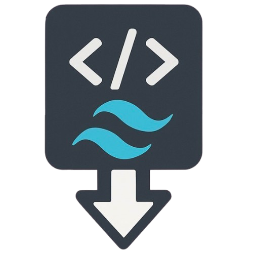

# Tailwind CSS Extractor

**Extract all used Tailwind CSS classes from a webpage and generate your own custom stylesheet.**  
<em>Clean. Secure. Offline.</em>

  <a href="#-about"><b>About</b></a> •
  <a href="#-features"><b>Features</b></a> •
  <a href="#-quick-start"><b>Quick Start</b></a> •
  <a href="#-installation"><b>Installation</b></a> •
  <a href="#-contribute"><b>Contribute</b></a>

## 💡 About

Tired of relying on external Tailwind CDNs?  
<b>Tailwind CSS Extractor</b> is a browser extension that scans your page, extracts <b>only the Tailwind classes you use</b>, and generates a <b>lightweight local stylesheet</b>.

> ⚡ Perfect for performance-focused, privacy-first web projects.

## ✨ Features

  <h3 style="margin-top:0">✅ Precise Extraction</h3>
  
Extracts only the Tailwind classes actually used in your project

  <h3 style="margin-top:0">💾 Local CSS</h3>
  
Generates a clean, downloadable CSS file ready for production

  <h3 style="margin-top:0">🕵️ Privacy First</h3>
  
Fully offline – no data leaves your browser

  <h3 style="margin-top:0">🔐 Zero Tracking</h3>
  
No tracking, no third-party dependencies

  <h3 style="margin-top:0">🧩 Simple Interface</h3>
  
Easy Chrome Extension interface with one-click extraction

## 🚀 Quick Start

  

    
1

    
Make sure the extension is active

  

  

    
2

    
Open your website using Tailwind CSS

  

  

    
3

    
Click on the 🔧 <b>puzzle icon</b> in the browser toolbar

  

  

    
4

    
In the popup, click the <b>Extract CSS</b> button

  

  

    
5

    
🉠Done! Your custom CSS file is ready to use

  

## 🛠 Installation

  

    📠This extension works best with <b>Google Chrome</b>
  

  

    

      
1.

      

        <a href="#" style="display:inline-flex;align-items:center;background:#3b82f6;color:white;padding:8px 15px;text-decoration:none;border-radius:5px;font-weight:bold">
          ⬇️ Download the extension folder
        </a>
      

    

    

      
2.

      
Open <b>Google Chrome</b>

    

    

      
3.

      
Go to: <code style="background:#e2e8f0;padding:3px 6px;border-radius:4px">chrome://extensions</code>

    

    

      
4.

      
Enable <b>Developer Mode</b> (top-right toggle)

    

    

      
5.

      
Click <b>Load unpacked</b>

    

    

      
6.

      
Select the downloaded folder

    

    

      
7.

      
✅ Done! The extension is now active

    

  

## 🙌 Contribute

  
Feel free to open issues, suggest features, or submit pull requests!

  <h2 style="margin-top:0;color:white">Ready to optimize your Tailwind project?</h2>
  
Built with love for developers who want clean, fast, and independent Tailwind projects.

  
© 2025 Tailwind CSS Extractor • MIT License

